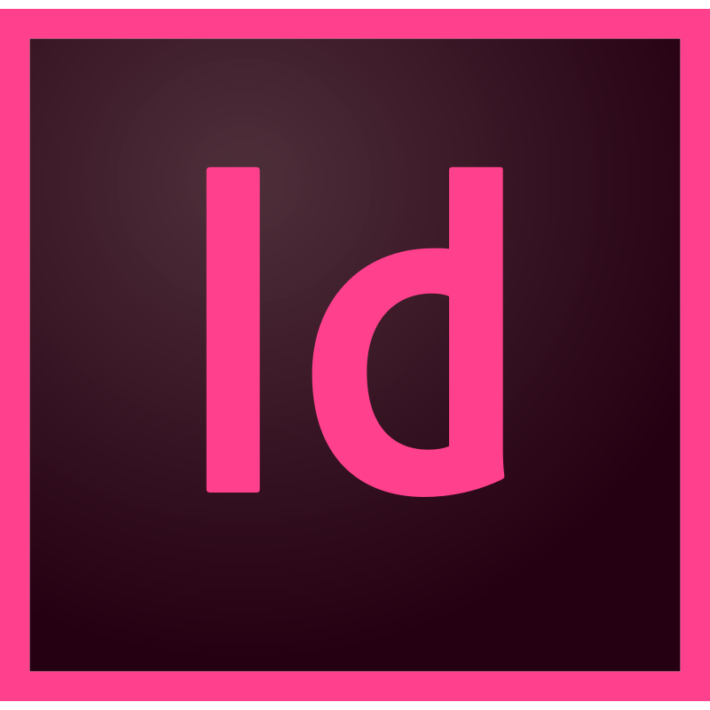

<h1 align="center">Hi &#129304, I'm Vinicius Zoppi</h1>
<h3 align="center">A begginer frontend dev based in Brazil with marketing skills able to develop your needs and grow your business.</h3>

 

- 🌱 I’m currently learning **HTML, CSS & JS**

- 💬 Talk to me about **frontend, html, css, design, logo design, travels, rock, life experience.** I'm sure we'll have a lot to put on the table.

- 📫 How to reach me **viniciusd.zoppi@gmail.com**
 

<h3 align="left">Connect with me:</h3>

<h3 align="left">Languages and Tools:</h3>

 

 

